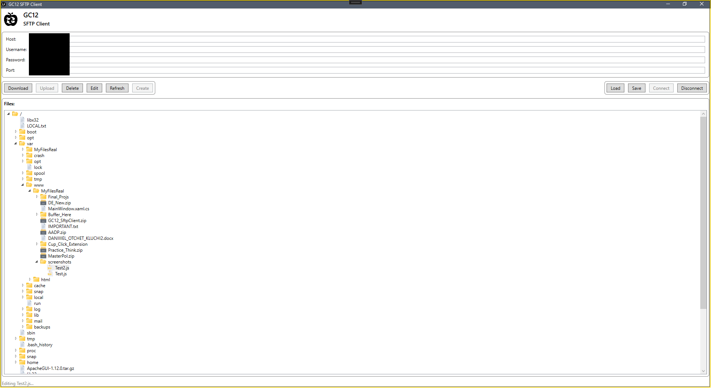
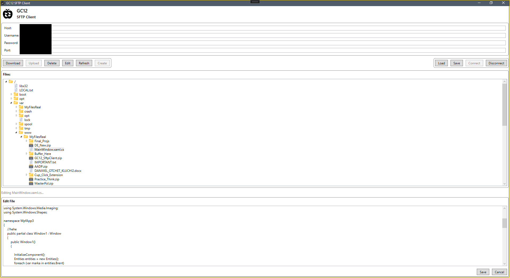
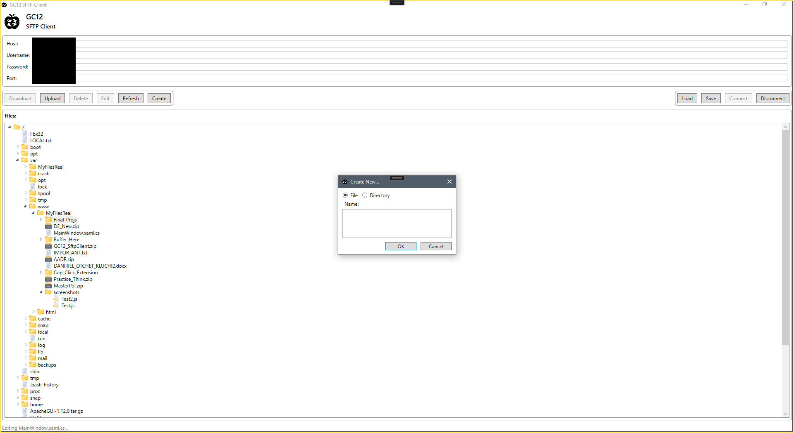

# GC12 SFTP Client

This is a SFTP client built with C# and WPF, designed for basic file management on remote servers. It allows you to connect to an SFTP server, browse directories, upload and download files, create and delete files and directories, and even edit small text files directly within the application.

## Screenshots





## Features

*   **Connect to SFTP Servers:** Connect to SFTP servers using hostname/IP address, username, password, and port (default is 22).
*   **Save and Load Connections:** Save connection details (host, username, password, port) to a `.gcsftp` file (a simple text file) and load them for quick access.
*   **Browse Directories:** Navigate the remote file system using a tree view.
*   **Lazy Loading:** Directory contents are loaded only when a folder is expanded, improving performance for directories with many files.
*   **Upload Files:** Upload files from your local machine to the selected remote directory.  Progress is displayed with a progress bar.
*   **Download Files:** Download files from the server to your local machine. Progress is displayed.
*   **Create Files and Directories:** Create new files and directories within the selected remote directory.
*   **Delete Files and Directories:** Delete files and directories from the server (with a confirmation prompt).
*   **Edit Small Text Files:** Edit text files (smaller than 50KB) directly within the application.  Changes are saved back to the server.
*   **File Icons:**  Displays different icons for folders (open/closed), archives (.zip, .rar, .7z), JavaScript files (.js), and generic files.
*   **Progress Bar:** A progress bar shows the progress of upload and download operations.
*   **Status Bar:** Displays status messages to indicate the current operation and any errors.
*   **Refresh Button**:  Manually refresh the file tree.

## Installation

1.  **Download:** Download the latest release ZIP archive from the [Releases](https://github.com/GDcocos12/GC12-SFTPClient/releases) page.
2.  **Extract:** Extract the contents of the ZIP archive to a folder on your computer.
3.  **Run:** Double-click the `GC12_SFTPClient.exe` file to launch the application.  No installation is required; it's a standalone executable.

## Prerequisites

*   .NET Framework (or .NET Core, depending on how you build it) - typically .NET 6.0 or later.
*   Visual Studio (recommended for building and development).
*   NuGet Package Manager (usually included with Visual Studio).

## Dependencies

The project uses the following NuGet packages:

*   **SSH.NET:** This is the core library for SFTP functionality.
*   **Newtonsoft.Json:** (Optional, but recommended) Used for serializing and deserializing connection data to/from the `.gcsftp` file.  You can modify the code to remove this dependency if you prefer a simpler file format (see comments in the code).

Install these packages using the NuGet Package Manager in Visual Studio:

```
Install-Package SSH.NET
Install-Package Newtonsoft.Json
```

## Building and Running

1.  **Clone the repository:**
    ```bash
    git clone https://github.com/GDcocos12/GC12-SFTPClient.git
    ```

2.  **Open the project in Visual Studio:** Open the `GC12_SFTPClient.sln` file.

3.  **Restore NuGet packages:** Right-click on the solution in Solution Explorer and select "Restore NuGet Packages".

4.  **Build the project:** Go to `Build` -> `Build Solution`.

5.  **Run the application:** Press F5 or go to `Debug` -> `Start Debugging`.

## Usage

1.  **Connect to a Server:**
    *   Enter the Hostname/IP address, Username, Password, and Port (optional, defaults to 22) in the connection details section.
    *   Click "Connect".
    *   Status messages will indicate the connection status.

2.  **Save and Load Connections:**
    *   Click "Save" to save the current connection details to a `.gcsftp` file.
    *   Click "Load" to load connection details from a `.gcsftp` file.

3.  **Browse Files:**
    *   Once connected, the remote file system will be displayed in the tree view.
    *   Expand folders by clicking the ">" icon. Folders are loaded lazily (on demand).

4.  **Upload Files:**
    *   Select a *directory* in the tree view.
    *   Click "Upload".
    *   Select the file you want to upload from your local machine.
    *   The file will be uploaded to the selected remote directory.

5.  **Download Files:**
    *   Select a *file* in the tree view.
    *   Click "Download".
    *   Choose where to save the file on your local machine.

6.  **Create Files/Directories:**
    *   Select a *directory* in the tree view.
    *   Click "Create".
    *   Choose whether to create a file or directory.
    *   Enter the name of the new file or directory.

7.  **Delete Files/Directories:**
    *   Select a *file* or *directory* in the tree view.
    *   Click "Delete".
    *   Confirm the deletion.

8.  **Edit Files:**
    *   Select a *file* (smaller than 50KB) in the tree view.
    *   Click "Edit".
    *   The file contents will be displayed in a text editor.
    *   Make changes and click "Save" to save them back to the server, or "Cancel" to discard changes.

9. **Refresh:**
    * Click the "Refresh" button to reload the file and folder list from the SFTP Server.

10. **Disconnect:**
    * Click the "Disconnect" button to close the connection.

## License

This project is licensed under the [MIT License](LICENSE.md) - see the `LICENSE.md` file for details.
